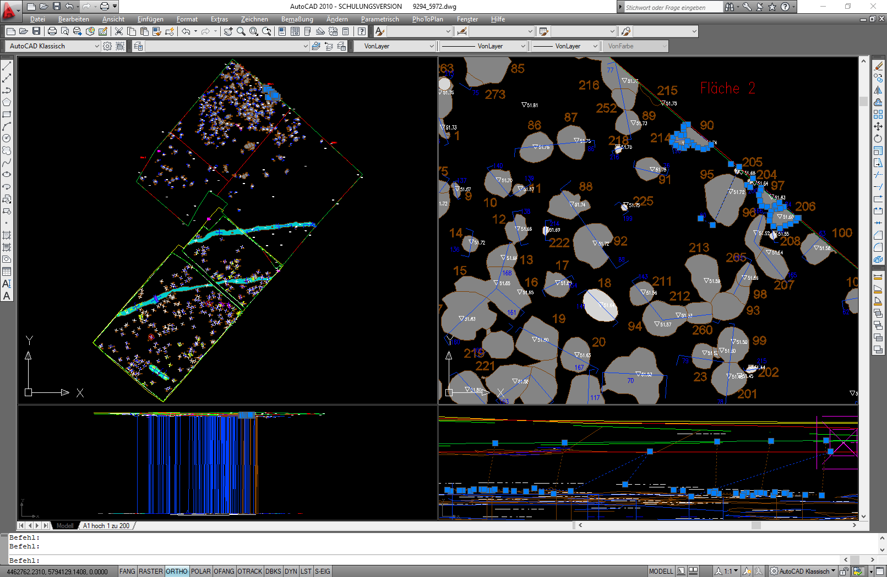

--- 
title: "CAD-Dokumentation zu GIS mit SpatiaLite migrieren"
author: "Christoph Rinne"
date: "`r format(Sys.time(), '%d. %B %Y')`"
output:
  html_document:
    toc: true
    toc_depth: 4
    toc_float: true
    number_sections: true
  pdf_document:
    fig_caption: true
    number_sections: true
    toc: true
    toc_depth: 4
    df_print: kable
license: CC-BY-SA 4.0
header-includes: \renewcommand{\contentsname}{Inhalt} \renewcommand{\figurename}{Abb.}
  \renewcommand{\tablename}{Tab.}
bibliography: ./inst/references.bib
csl: ./inst/journal-of-archaeological-science.csl
papersize: a4
email: crinne@ufg.uni-kiel.de
urlcolor: blue
link-citations: yes
linkcolor: blue
number_sections: yes
lang: de-DE
description: Handreichung zur Bereinigung und Migration von CAD-Dokumentation von
  Ausgrabungen zur SpatiaLite.
---

\newpage

# Vorwort {-}


```{r R-script-load-library-setup-connection, include=FALSE}
library(RSQLite)
juffdb<-dbConnect(RSQLite::SQLite(), dbname = "./data/JUff.sqlite")
```

```{sql basic-table-drop, eval=FALSE, connection=juffdb, include=FALSE}
Drop table if exists hatch_layer_2d;
Drop table if exists hatch_layer_2D_pattern;
Drop table if exists line_layer_2d;
Drop table if exists polyg_layer_2d;
Drop table if exists text_layer_3d;
Drop table if exists text_layer_3d_attr;
```


# Einführung

Ziel ist die Überführung von Ausgrabungsplänen aus CAD-Dateien in ein GIS. Ausgang ist der CAD-Plan einer Ausgrabung für ein Landesdenkmalamtüber insgesamt drei Ausgrabungsphasen mit einem Personalwechsel bei der Ausgrabungsleitung und der Grabungstechnik [^1].

[^1]: Genehmigung des Amtes und der Ausgräbering noch erbitten.

**Anmerkungen** 

 - Menüpfade oder Abfolgen von Fenstern werden mit schlichten Pfeilen dargestellt: "Datei > Speichern". 
 - Tastaturkürzel, die ich gerne Nutze, stehen in Spitzklammern je Taste: \<strg> + \<c>. 
 - Schalter auf Formularen werden in [] gesetzt: [OK] 
 - Zur Darstellung von Befehlen im Text nutze ich die in Markdown übliche Darstellung von Code oder eben Anweisungen an den Computer: ```anweisung```. 
 - SQL-Anweisungen sind nicht in Großbuchstaben gesetzt, die farbliche Gestaltung macht dies überflüssig. Eine Ausnahme bilden die verwendeten Funktion bei denen der *CamelCase* für die bessere Lesbarkeit beibehalten wird. Auch wird der Anfang einer  Anweisungen jeweils großgeschrieben, um aufeinander folgende Anweisungen etwas besser zu trennen. Im vorliegenden Fall wurden Leerzeichen in Objektnamen vermieden, dadurch müssen Tabellen und Feldnamen nicht in "" stehen.
 - Der Text enthält viele Links die auf Papier nicht funktionieren. Sparen Sie bitte Papier und verzichten Sie auf den Ausdruck. 

## Verwendete Software & Informationen

 - OS Windows 10
 - QGIS 3.22.4-Białowieża Quelle: [https://qgis.org]
 - SpatiaLite SpatiaLite GUI 2.1.0 beta1, SpatiaLite 5.0.0, SQLite 3.33.0, Quelle [http://www.gaia-gis.it]
 - AutoCAD 2010, Quelle für aktuelle *kostenlose* Schulversionen:  [https://www.autodesk.de/education/edu-software/overview]
 
 - SpatiaLite Cookbook html [http://www.gaia-gis.it/gaia-sins/spatialite-cookbook/index.html]
 - SpatiaLite Funktionen [http://www.gaia-gis.it/gaia-sins/spatialite-sql-5.0.0.html] 

AutoCAD ist eine sehr komplexe Software und Ausgrabungen können eine komplexe Struktur annehmen, die es zu dokumentieren gilt. Erwarten Sie nicht, dass die notwendige Kompetenz beim Erstellen der digitalen Daten stets vorhanden war, auch der Autor (Chr. Rinne) ist hier nur Autodidakt. 

Rechnen Sie mit Fehlern im originalen Datenbestand und einer ggf. nicht optimalen Struktur oder erwarten Sie nicht die von Ihnen bevorzugte Struktur. Korrektur von Fehler und Anpassungen der Struktur erfolgen sicher am besten im originalen Arbeitsumfeld, also CAD.

Neben AutoCAD gibt es teils kostengünstigere Alternativen, u.a.:

 - BricsCAD [https://www.bricsys.com]
 - MegaCAD [https://www.megacad.de/]
 
# Jakob-Uffrecht-Straße

## AutoCAD Quelldatei (dxf)

Es handelt sich um einen mehrperiodigen Siedlungs- und Bestattungsplatz. Untersucht wurden gut 8.300 m² mit 589 Befunden, überwiegend dder Bronzezeit (316), 11 eindeutig neolithischen Befunden, darunter ein doppeltes Grabensystem, 260 nicht weiter datierten oder allgemein urgeschichtlichen und zwei neuzeitlichen Befunden. Zu dem CAD Plan liegen für jede Ausgrabung eine Datenbank (MS Access) mit weiteren Informationen vor. Diese Daten können nach der Aufarbeitung des CAD Planes mit den dann eindeutig benannten Befunden verbunden werden. Dies ist aber nicht Teil dieses Skriptes. 



Die Zeichnung enthält 171 Polylinien (2D), 33 Kreise (2D), 263 Absatztexte (MText), 361 Linien (3D), 239 Schraffuren, 427 Blockreferenzen, 810 Polylinien (3D), 497 einfache Texte und 369 Punkte (3D). In dieser Liste fallen vor allem zwei Objektypen auf, die Kreise und der Absatztext. Die Kreise wurden für einige Befunde verwendet und liegen als flache Geometrie auf einer sinnvollen Höhe. Der Absatztext wurde bei einer Maßnahme für die Befundnummern verwendet. Da es sich um keine "normale" Geometrie handelt und nur die Textbox aber nicht der Text einen Lagebezug zu den Koordinaten der Grabung hat muss dies noch in AutoCAD aufgelöst werden.

```{r 'Table 1 List of layers in the dwg.', echo=FALSE}
tab01<-read.table("./data-raw/JUff_layer.tab", header = TRUE, sep = "\t", dec = ",")
# if output is html table as interactive datatable else table with limit
if (knitr::is_html_output()) {
  DT::datatable(tab01, filter = "top", options=list(pagelength=10), caption="Liste der
 Planzeichnungen und erstellten DWG-Dateien.")
} else {
  knitr::kable(tab01)
}
```

Eine weiter Kontrolle ergibt:

- Die Anzahl der Layer ist überschaubar, eine Trennung nach den Grabungsflächen ist nicht erfolgt, die Namen sind leider nicht ganz stringent, vor allem die Befundnummern sind mehrfach vertreten.
- Einige Namen verweisen auf konkrete Objekte und ensprechen damit nicht der allgemeinen Nomenklatur. 
- Keine weiteren BKS definiert, die Koordinaten lassen ein GKB Zone 4 vermuten (das Elipsoidmodell ergibt sich daraus aber nicht).
- Die Einheit ist erwartbar in Millimeter statt den verwendeten Meter.
- Zahlreiche Befundlinien sind nicht geschlossen, auf dem Befundlayer liegen auch Kreise. 
- Die Ansicht von der Seite offenbart das größte Problem. Vielfach laufen Polygone von der realen Höhe auf 0 runter.  Daneben sind aber auch in der Grabung mehrere Höhenbereiche der Objekte mit einzelnen Verbindungslinien zu erkennen. Falsche Prismenhöhe beim Messen?

Es ist vor allem dieses letzte Problem, das bei der nachfolgenden Aufarbeitung besonders betrachtet werden soll. 

*Wichtig* Der MText wird weder von SpatiaLite noch von QGIS beim Import der DXF-Datei erkannt. Der Export dieser Objekte in AutoCAD über "Extras > Datenextraktion" ist möglich, der Inhalt wird aber auf den Ursprung der Textbox bezogen und die ggf. mehrzeiligen Texte werden als ein Textfeld hieran angehängt wodurch sich jede Zeile in Abhängigkeit der Texthöhe zunehmend von der Koordinate entfernt. Es empfiehlt sich, MText mit dem Befehl ```ursprung (_explode)``` in einfachen Text aufzulösen. Damit wird er auch beim Import der DXF-Datei je Zeile als Text erkannt und dem Einfügepunkt, meist der linke Ursprung der Basislinie, zugewiesen.

Um MText pauschal in Text umzuwandeln selektieren sie diesen pauschal mit ```qselect```, Anwenden auf: Ganze Zeichnung, Objekttyp: MText, Eigenschaft: Farbe = VonLayer, In neuen Auswahlsatz einfügen und [OK]. Danach den Befehl ```ursprung``` für die ausgewählten Objekte eingeben und ausführen. Da unter Umständen MText nicht die Farbe des Layers gehabt haben kann sollten Sie erneut alles Markieren und im Fenster der Eigenschaften (``eigenschaften```) im oberen drop-down die Anzahl der vorhandenen Objekttypen auf MText kontrollieren.


## SpatiaLite GUI

Nach dem Start der GUI bitte "Menu > Create a new (empty) SQLite DB" ausführen. In diese wird die dxf-Datei mit der gesamten Ausgrabung importiert: "Menu > Advanced > Import DXF drawings". Im Fenster zum Import bitte folgende Angaben: (x) Import selected DXF drawing file only, SRID: 31467, [v] Append to already existing tables, Dimensions: (x) authomatic 2D/3D, (x) mixed layers, Special Rings handling (x) none. Diese Angaben beziehen sich auf den aktuellen Import und müssen ggf. angepasst werden. Die Option 'mixed layers' trennt nur die Typen (Punkt, Linie Polygon, Text), die Layer werden als Attribut (Spalte) angelegt. Die Alternative trennt erst die Layer und dann nach Typen, erstellt also das x-Fache der vorhandenen CAD-Layer als Tabellen.

Als Ergebnis sind folgende Tabellen überwiegend mit den Spalten feature_id, filename, layer und geometry als auch und eine *view* (gespeicherte Abfrage) vorhanden:

- hatch_layer_2d
- hatch_layer_2d_pattern
- line_layer_3d
- line_layer_3d_attr
- line_layer_3d_attr_view
- point_layer_3d
- polyg_layer_3d_attr
- polyg_layer_3d_attr_view
- polyg_layer_2d
- text_layer_3d

### Datenkontrolle

Prüfen Sie die jeweils resultierende Geometrie, vor allem ob MULTI-Typen vorliegen, z.B. MULTIPOLYGON. Das ist hier nicht der Fall und damit können Teilbefunde nicht zu einem kombinierten Objekt verschmolzen werden. Bei Bedarf lautet die Funktion in SpatiaLite: [CastToMulti](http://www.gaia-gis.it/gaia-sins/spatialite-sql-5.0.0.html#cast). An dieser Stelle ein schnelle Kontrolle des Datenbestandes durch eine Aufstellung der Layer in jeder Tabelle.

```{sql, eval=FALSE, connection=juffdb, include=TRUE}
Select layer, GeometryType(geometry) as geomtype, Count(*) as n 
from hatch_layer_2d
group by 1, 2
```

Die Syntax gruppiert auf die erste und zweite Spalte, den Layernamen und die Abfrage des Geometrietyps, dazu liefert sie die Anzahl der Einträge. Warum einige Geometrien nicht vorliegen (NULL) kann ich nicht sagen. Im vorliegenden Fall handelt es sich durchgängig um eine Kreuzschraffur (ANSI37) für Tiergänge oder andere Störungen. 

```{sql, eval=FALSE, connection=juffdb, include=TRUE}
select layer, GeometryType(geometry) as geomtype, Count(*) as n 
from line_layer_2d
group by 1, 2
```

Diese Abfrage liefert im vorliegenden Fall zwei Problemgruppen: Pl01_Steine hat elf und PL02_Befunde hat zwei Linienobjekte. In allen Fällen sollten das aber Polygone sein. Die Korrektur erfolgt am besten in CAD: beim Layer Steine ist es ein Stein der aus zehn einzelnen Linien besteht und beim Layer Befunde sind es zwei nicht geschlossene Befunde. Die Grabungsgrenzen sind im vorliegenden Fall  aufgrund der Vorgaben heterogen sowohl als Polygon als auch als Linie vorhanden. Hier ist die jeweilige Fragestellung relevant: z.B. Fläche bemessen oder 1:1-Abbildung des Papiers.

Die Tabelle text_layer_3d_attr und die Sicht (*view*) text_layer_3d_attr_view liefern in diesem Fall keine erhellenden Informationen und können wie hatch_layer_2d gelöscht werden.

# Datenbereinigung

## Höhenfehler

Problem: Einzelne Punkte von Linien oder Polygone wurden an anderen Objekten gefangen oder von Hand gezeichnet, damit haben diese erkennbar einen falschen Z-Wert. Im Norden grenzen einige Befunde an die Schnittgrenze, die Befundlinien des Planum 1 fangen die Schnittgrenze auf dem Planum 0. Oder die Ansichtshaken der Profile sind von Hand gezeichnet und fallen dasmit auf die Höhe Null.

```{sql, eval=FALSE, connection=juffdb, include=TRUE}
select st_maxz(geometry), st_npoints(geometry), st_astext(geometry) from line_layer_3d
where st_minz(geometry) = 0 and st_maxz(geometry) <> 0;
```
Das liefer aber keine Einträge. Warum? MinZ ist nicht 0, sondern nahe 0. Also Schwellwert der Differenz definieren. Da nur potentielle Problemfälle gefunden werden sollen eher offensiv: hier 0.3 m.

```{sql, eval=FALSE, connection=juffdb, include=TRUE}
select st_maxz(geometry) - st_minz(geometry) as d, 
	st_minz(geometry), st_maxz(geometry), st_npoints(geometry) 
from line_layer_3d
where  d > 0.3
order by d desc; 
```

Liefert 86 Linien mit ptentiellem Z-Wert-Fehler.

```{sql, eval=FALSE, connection=juffdb, include=TRUE}
begin transaction;
drop table if exists line_layer_3d_err;
create temp table line_layer_3d_err as
select feature_id, geometry
from line_layer_3d
where  st_maxz(geometry) - st_minz(geometry) > 0.3;
select RecoverGeometryColumn('line_layer_3d_err', 'geometry', 31468, 'linestring', 'XYZ');
commit;
```

feature_id = 616 hat 4 Punkte

```{sql, eval=FALSE, connection=juffdb, include=TRUE}
begin transaction;
drop table if exists line_err_multipoints;
CREATE TABLE line_err_multipoints AS 
select feature_id as line_feature_id, st_dissolvepoints(geometry) as geometry
from line_layer_3d
where  st_maxz(geometry) - st_minz(geometry) > 0.3;

Select RecoverGeometryColumn('line_err_multipoints', 'geometry', 31468, 'multipoint', 'XYZ');

drop table if exists line_err_points;
create table line_err_points as 
SELECT lmp.rowid, lmp.line_feature_id, e.item_no, 
  ST_x(e.geometry) as x, ST_y(e.geometry) as y, ST_Z(e.geometry) AS z
FROM line_err_multipoints AS lmp
JOIN ElementaryGeometries AS e ON (e.f_table_name = 'line_err_multipoints'
AND e.origin_rowid = lmp.rowid);
commit;

```

Jetzt noch über die Liste der Punkte laufen und falsche z-Werte ersetzen.
mean z-wert berechnen sum(z)/count(z) group by line_feature_id
case item_no = 0 and abs(z-wert - mean(z-wert)) > 0.3 dann item_no + 1
Anderen Z-Wert nachschlagen über item_no - 1 oder oder item_no + 1
Dann mittels aggregate, group_concat und 
polygonfromtext('POLYGON Z(' || group_concat(x || ' ' || y || ' ' || z, ', ') ||)', '|| srid)


```{sql, eval=FALSE, connection=juffdb, include=TRUE}
```

```{sql, eval=FALSE, connection=juffdb, include=TRUE}
```

# Literatur