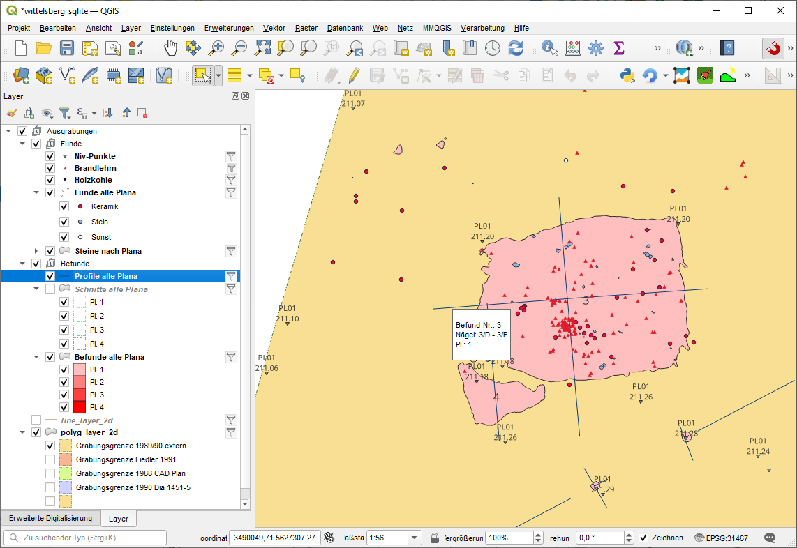

--- 
title: "CAD-Dokumentation zu GIS mit SpatiaLite migrieren"
author: "Christoph Rinne"
date: "`r format(Sys.time(), '%d. %B %Y')`"
output:
  html_document:
    toc: true
    toc_depth: 4
    toc_float: true
    number_sections: true
  pdf_document:
    fig_caption: true
    number_sections: true
    toc: true
    toc_depth: 4
    df_print: kable
license: CC-BY-SA 4.0
header-includes: \renewcommand{\contentsname}{Inhalt} \renewcommand{\figurename}{Abb.}
  \renewcommand{\tablename}{Tab.}
bibliography: ./inst/references.bib
csl: ./inst/journal-of-archaeological-science.csl
papersize: a4
email: crinne@ufg.uni-kiel.de
urlcolor: blue
link-citations: yes
linkcolor: blue
number_sections: yes
lang: de-DE
description: Handreichung zur Bereinigung und Migration von CAD-Dokumentation von
  Ausgrabungen zur SpatiaLite.
---

\newpage

# Vorwort {-}


```{r R-script-load-library-setup-connection, include=FALSE}
library(RSQLite)
juffdb<-dbConnect(RSQLite::SQLite(), dbname = "./data/JUff.sqlite")
```

```{sql basic-table-drop, eval=FALSE, connection=juffdb, include=FALSE}
Drop table if exists hatch_layer_2d;
Drop table if exists hatch_layer_2D_pattern;
Drop table if exists line_layer_2d;
Drop table if exists polyg_layer_2d;
Drop table if exists text_layer_3d;
Drop table if exists text_layer_3d_attr;
```


# Einführung

Ziel ist die Überführung von Ausgrabungsplänen aus CAD-Dateien in ein GIS. Ausgang ist der CAD-Plan einer Ausgrabung für ein Landesdenkmalamtüber insgesamt drei Ausgrabungsphasen mit einem Personalwechsel bei der Ausgrabungsleitung und der Grabungstechnik [^1].

[^1]: Genehmigung des Amtes und der Ausgräbering noch erbitten.

**Anmerkungen** 

 - Menüpfade oder Abfolgen von Fenstern werden mit schlichten Pfeilen dargestellt: "Datei > Speichern". 
 - Tastaturkürzel, die ich gerne Nutze, stehen in Spitzklammern je Taste: \<strg> + \<c>. 
 - Schalter auf Formularen werden in [] gesetzt: [OK] 
 - Zur Darstellung von Befehlen im Text nutze ich die in Markdown übliche Darstellung von Code oder eben Anweisungen an den Computer: ```anweisung```. 
 - SQL-Anweisungen sind nicht in Großbuchstaben gesetzt, die farbliche Gestaltung macht dies überflüssig. Eine Ausnahme bilden die verwendeten Funktion bei denen der *CamelCase* für die bessere Lesbarkeit beibehalten wird. Auch wird der Anfang einer  Anweisungen jeweils großgeschrieben, um aufeinander folgende Anweisungen etwas besser zu trennen. Im vorliegenden Fall wurden Leerzeichen in Objektnamen vermieden, dadurch müssen Tabellen und Feldnamen nicht in "" stehen.
 - Der Text enthält viele Links die auf Papier nicht funktionieren. Sparen Sie bitte Papier und verzichten Sie auf den Ausdruck. 

## Verwendete Software & Informationen

 - OS Windows 10
 - QGIS 3.22.4-Białowieża Quelle: [https://qgis.org]
 - SpatiaLite SpatiaLite GUI 2.1.0 beta1, SpatiaLite 5.0.0, SQLite 3.33.0, Quelle [http://www.gaia-gis.it]
 - AutoCAD 2010, Quelle für aktuelle *kostenlose* Schulversionen:  [https://www.autodesk.de/education/edu-software/overview]
 
 - SpatiaLite Cookbook html [http://www.gaia-gis.it/gaia-sins/spatialite-cookbook/index.html]
 - SpatiaLite Funktionen [http://www.gaia-gis.it/gaia-sins/spatialite-sql-5.0.0.html] 

AutoCAD ist eine sehr komplexe Software und Ausgrabungen können eine komplexe Struktur annehmen, die es zu dokumentieren gilt. Erwarten Sie nicht, dass die notwendige Kompetenz beim Erstellen der digitalen Daten stets vorhanden war, auch der Autor (Chr. Rinne) ist hier nur Autodidakt. 

Rechnen Sie mit Fehlern im originalen Datenbestand und einer ggf. nicht optimalen Struktur oder erwarten Sie nicht die von Ihnen bevorzugte Struktur. Korrektur von Fehler und Anpassungen der Struktur erfolgen sicher am besten im originalen Arbeitsumfeld, also CAD.

Neben AutoCAD gibt es teils kostengünstigere Alternativen, u.a.:

 - BricsCAD [https://www.bricsys.com]
 - MegaCAD [https://www.megacad.de/]
 
# Jakob-Uffrecht-Straße

## AutoCAD Quelldatei (dxf)

Es handelt sich um einen mehrperiodigen Siedlungs- und Bestattungsplatz. Untersucht wurden gut 8.300 m² mit 589 Befunden, überwiegend dder Bronzezeit (316), 11 eindeutig neolithischen Befunden, darunter ein doppeltes Grabensystem, 260 nicht weiter datierten oder allgemein urgeschichtlichen und zwei neuzeitlichen Befunden. Zu dem CAD Plan liegen für jede Ausgrabung eine Datenbank (MS Access) mit weiteren Informationen vor. Diese Daten können nach der Aufarbeitung des CAD Planes mit den dann eindeutig benannten Befunden verbunden werden. Dies ist aber nicht Teil dieses Skriptes. 


Die Zeichnung enthält 171 Polylinien (2D), 33 Kreise (2D), 263 Absatztexte (MText), 361 Linien (3D), 239 Schraffuren, 427 Blockreferenzen, 810 Polylinien (3D), 497 einfache Texte und 369 Punkte (3D). In dieser Liste fallen vor allem zwei Objektypen auf, die Kreise und der Absatztext. Die Kreise wurden für einige Befunde verwendet und liegen als flache Geometrie auf einer sinnvollen Höhe. Der Absatztext wurde bei einer Maßnahme für die Befundnummern verwendet. Da es sich um keine "normale" Geometrie handelt und nur die Textbox aber nicht der Text einen Lagebezug zu den Koordinaten der Grabung hat muss dies noch in AutoCAD aufgelöst werden.

```{r 'Table 1 List of layers in the dwg.', echo=FALSE}
tab01<-read.table("./data-raw/JUff_layer.tab", header = TRUE, sep = "\t", dec = ",")
# if output is html table as interactive datatable else table with limit
if (knitr::is_html_output()) {
  DT::datatable(tab01, filter = "top", options=list(pagelength=10), caption="Liste der
 Planzeichnungen und erstellten DWG-Dateien.")
} else {
  knitr::kable(tab01)
}
```

Eine weiter Kontrolle ergibt:

- Die Anzahl der Layer ist überschaubar, eine Trennung nach den Grabungsflächen ist nicht erfolgt, die Namen sind leider nicht ganz stringent, vor allem die Befundnummern sind mehrfach vertreten.
- Einige Namen verweisen auf konkrete Objekte und ensprechen damit nicht der allgemeinen Nomenklatur. 
- Keine weiteren BKS definiert, die Koordinaten lassen ein GKB Zone 4 vermuten (das Elipsoidmodell ergibt sich daraus aber nicht).
- Die Einheit ist erwartbar in Millimeter statt den verwendeten Meter.
- Zahlreiche Befundlinien sind nicht geschlossen, auf dem Befundlayer liegen auch Kreise. 
- Die Ansicht von der Seite offenbart das größte Problem. Vielfach laufen Polygone von der realen Höhe auf 0 runter.  Daneben sind aber auch in der Grabung mehrere Höhenbereiche der Objekte mit einzelnen Verbindungslinien zu erkennen. Falsche Prismenhöhe beim Messen?

Es ist vor allem dieses letzte Problem, das bei der nachfolgenden Aufarbeitung besonders betrachtet werden soll. 

*Wichtig* Der MText wird weder von SpatiaLite noch von QGIS beim Import der DXF-Datei erkannt. Der Export dieser Objekte in AutoCAD über "Extras > Datenextraktion" ist möglich, der Inhalt wird aber auf den Ursprung der Textbox bezogen und die ggf. mehrzeiligen Texte werden als ein Textfeld hieran angehängt wodurch sich jede Zeile in Abhängigkeit der Texthöhe zunehmend von der Koordinate entfernt. Es empfiehlt sich, MText mit dem Befehl ```ursprung (_explode)``` in einfachen Text aufzulösen. Damit wird er auch beim Import der DXF-Datei je Zeile als Text erkannt und dem Einfügepunkt, meist der linke Ursprung der Basislinie, zugewiesen.

Um MText pauschal in Text umzuwandeln selektieren sie diesen pauschal mit ```qselect```, Anwenden auf: Ganze Zeichnung, Objekttyp: MText, Eigenschaft: Farbe = VonLayer, In neuen Auswahlsatz einfügen und [OK]. Danach den Befehl ```ursprung``` für die ausgewählten Objekte eingeben und ausführen. Da unter Umständen MText nicht die Farbe des Layers gehabt haben kann sollten Sie erneut alles Markieren und im Fenster der Eigenschaften (``eigenschaften```) im oberen drop-down die Anzahl der vorhandenen Objekttypen auf MText kontrollieren.


## SpatiaLite GUI

Nach dem Start der GUI bitte "Menu > Create a new (empty) SQLite DB" ausführen. In diese wird die dxf-Datei mit der gesamten Ausgrabung importiert: "Menu > Advanced > Import DXF drawings". Im Fenster zum Import bitte folgende Angaben: (x) Import selected DXF drawing file only, SRID: 31467, [v] Append to already existing tables, Dimensions: (x) authomatic 2D/3D, (x) mixed layers, Special Rings handling (x) none. Diese Angaben beziehen sich auf den aktuellen Import und müssen ggf. angepasst werden. Die Option 'mixed layers' trennt nur die Typen (Punkt, Linie Polygon, Text), die Layer werden als Attribut (Spalte) angelegt. Die Alternative trennt erst die Layer und dann nach Typen, erstellt also das x-Fache der vorhandenen CAD-Layer als Tabellen.

Als Ergebnis sind folgende Tabellen überwiegend mit den Spalten feature_id, filename, layer und geometry als auch und eine *view* (gespeicherte Abfrage) vorhanden:

- hatch_layer_2d (benötigt)
- hatch_layer_2D_pattern (nicht benötigt)
- line_layer_2d (benötigt)
- polyg_layer_2d  (benötigt)
- text_layer_3d  (benötigt)
- text_layer_3d_attr (nicht benötigt)
- text_layer_3d_view (nicht benötigt)

### Datenkontrolle

Prüfen Sie die jeweils resultierende Geometrie, vor allem ob MULTI-Typen vorliegen, z.B. MULTIPOLYGON. Das ist hier nicht der Fall und damit können Teilbefunde nicht zu einem kombinierten Objekt verschmolzen werden. Bei Bedarf lautet die Funktion in SpatiaLite: [CastToMulti](http://www.gaia-gis.it/gaia-sins/spatialite-sql-5.0.0.html#cast). An dieser Stelle ein schnelle Kontrolle des Datenbestandes durch eine Aufstellung der Layer in jeder Tabelle.

```{sql, eval=FALSE, connection=juffdb, include=TRUE}
Select layer, GeometryType(geometry) as geomtype, Count(*) as n 
from hatch_layer_2d
group by 1, 2
```

Die Syntax gruppiert auf die erste und zweite Spalte, den Layernamen und die Abfrage des Geometrietyps, dazu liefert sie die Anzahl der Einträge. Warum einige Geometrien nicht vorliegen (NULL) kann ich nicht sagen. Im vorliegenden Fall handelt es sich durchgängig um eine Kreuzschraffur (ANSI37) für Tiergänge oder andere Störungen. 

```{sql, eval=FALSE, connection=juffdb, include=TRUE}
select layer, GeometryType(geometry) as geomtype, Count(*) as n 
from line_layer_2d
group by 1, 2
```

Diese Abfrage liefert im vorliegenden Fall zwei Problemgruppen: Pl01_Steine hat elf und PL02_Befunde hat zwei Linienobjekte. In allen Fällen sollten das aber Polygone sein. Die Korrektur erfolgt am besten in CAD: beim Layer Steine ist es ein Stein der aus zehn einzelnen Linien besteht und beim Layer Befunde sind es zwei nicht geschlossene Befunde. Die Grabungsgrenzen sind im vorliegenden Fall  aufgrund der Vorgaben heterogen sowohl als Polygon als auch als Linie vorhanden. Hier ist die jeweilige Fragestellung relevant: z.B. Fläche bemessen oder 1:1-Abbildung des Papiers.

Die Tabelle text_layer_3d_attr und die Sicht (*view*) text_layer_3d_attr_view liefern in diesem Fall keine erhellenden Informationen und können wie hatch_layer_2d gelöscht werden.

### Variante: Viele Tabellen

Eine Option sowohl die Informationen aus 'polyg_layer_2d' nach Befunden, Grabungsgrenzen, Steinen  etc. zu trennen und mit dem Feld 'label' aus 'text_layer_3d' zu verbinden kann über Abfrage simuliert und dann als *create-table*-Anweisung umgesetzt werden. Dies führt zu sehr vielen Tabellen und ist hier nicht Ziel des Vorgehens. 

```{sql, eval=FALSE, connection=juffdb, include=TRUE}
Select a.*, b.label
from polyg_layer_2d as a 
join text_layer_3d as b on ST_Within(b.geometry, a.geometry)
where a.layer = 'PL01_Befund'
  and b.layer = 'PL01_BefundNr';
```

Wird der vorangehenden Abfrage ein ```create table as Pl01_BefundeNr``` vorangestellt wird die entsprechende Tabelle erstellt. Nach einem *refresh* der Datenbank ist diese Tabelle sichtbar. Die Angaben zur dort enthaltene Geometrie kann erst mit 'Check geometries' aus dem Kontextmenü überprüft und dann mit 'Recover gemetry column' wieder hergestellt werden. Vergleichbare Vorgänge für jede Informationseinheit wiederholen.

Das ist die arbeitsreiche und in der Datenhaltung schwierigere Variante wegen der zunehmend vielen Tabellen. Das ist nicht zu empfehlen. Der eigentliche Vorteil: der Lernaufwand liegt nahe NULL.

### Variante: Zwei wichtige Tabellen

Bei dieser Variante wird die Tabelle 'polyg_layer_2d' um zwei sinnvolle Spalten für wichtige Informationen erweitern: (Befund-)Nummer und Info. Ebenso auch 'line_layer_2d'. Dabei gilt: unbedingt die folgenden Updates bei exklusivem Zugriff von SpatiaLite ausführen und nachfolgend im Kontextmenü der Geometriespalte 'Update Layer Statistics' aufrufen.

Anmerkungen: SQLite hat *type affinity*, trivialisierte Info: in einem Feld vom Typ *integer* kann auch '8820A' gespeichert werden. Sollen mehrere auf einmal ausgeführt werden sind diese durch ```begin transaction;``` einzuleiten und mit ```commit``` am Ende auszuführen. 

```{sql, eval=FALSE, connection=juffdb, include=TRUE}
BEGIN TRANSACTION;
Alter table polyg_layer_2d add column number integer;
Alter table polyg_layer_2d add column info text;
Alter table line_layer_2d add column number integer;
Alter table line_layer_2d add column info text;
Update Geometry_Columns_Statistics set last_verified = 0;
Select UpdateLayerStatistics();
COMMIT;
```

#### Befundnummern

Nun die Befundnummer mittels *spatial join* nachschlagen und in dem Feld 'number' eintragen.

```{sql, eval=FALSE, connection=juffdb, include=TRUE}
Update polyg_layer_2d as c
set number = (select b.label
from polyg_layer_2d as a 
join text_layer_3d as b on ST_Within(b.geometry, a.geometry)
where a.layer = 'PL01_Befund'
  and b.layer = 'PL01_BefundNr'
  and a.feature_id = c.feature_id)
where c.number is null;
```

Diesen Vorgang für alle Plana wiederholen. Wenn der Text neben dem Befund steht ist eine Option zunehmende Puffer um den Punkt des Textes (Befundnummer) zu rechnen und dann st_intersect zu nutzen. Sollte das Feld 'number' noch NULL sein wird es sukzessive gefüllt:

```{sql, eval=FALSE, connection=juffdb, include=TRUE}
Update polyg_layer_2d as c
set number = (select b.label
from polyg_layer_2d as a 
join text_layer_3d as b on ST_Intersects(st_buffer(b.geometry,0.2), a.geometry)
where a.layer = 'PL01_Befund'
  and b.layer = 'PL01_BefundNr'
  and a.feature_id = c.feature_id)
where c.number is null;
```

Nicht alles wird korrekt laufen. In QGIS die Beschriftung der Befunde einrichten, kontrollieren und die Probleme von Hand analog der folgenden Anweisung  bereinigen. Die "Massenzuweisung" sind überwiegend die vielen einzelnen Befunde der tieferen Plana die nicht individuell benannt wurden. Optional zur Handarbeit über die Liste von ID's könnte auch mit einem großen Puffer um die Befundnummer (s.o.) gearbeitet werden. Allerdings sollte ein Pfosten in einem Grubenhaus besser eine neue Befundnummer erhalten oder die einzelnen Quadranten einer Grube im Planum 1 sollten doch eher zu einem Befund verschmolzen werden. Dies sind individuelle und situativ zu treffende Entscheidungen.

```{sql, eval=FALSE, connection=juffdb, include=TRUE}
Begin transaction;
Update polyg_layer_2d
set number = '9013'
where feature_id = 111;
Update polyg_layer_2d
set number = '20B'
where feature_id = 80;
Update polyg_layer_2d
set number = '9011'
where feature_id in (438, 439, 814, 815, 817, 818, 819, 820);
Update polyg_layer_2d
set number = '9009'
where feature_id in (102, 444, 445, 446, 812, 813, 1001, 1002, 1003, 1004, 1005, 1006, 1007, 1008, 1009, 1010, 1011, 1012, 1013, 1014, 1015, 1016, 1017, 1018, 1019);
Commit;
```

Abschließend ggf. die 0-Nummern wieder auf NULL setzen.

```{sql, eval=FALSE, connection=juffdb, include=TRUE}
Update polyg_layer_2d
set number = NULL
where number = 0;
```

Für die Darstellung der Befunde über alle Plana in QGIS kann die Tabelle 'polyg_layer_2d' der Karte hinzugefügt werden. Den Objektfilter setzen auf ```"layer" like 'PL0%_Befund'```, dann bei der Symbologie auf 'Abgestuft' wechseln und als Wert mit ```to_int(substr("layer",3,2))``` nur die Planumsnummer in eine Ganzzahl konvertiert aus dem standardisierten Layernamen "Pl01_Befunde" holen. Alles klassifizieren und bei Legendenformat: "Planum %%2" eintragen.

#### Befunde mit Schraffur

Im vorliegenden Fall sind die Tiergänge und andere Störungen schraffiert. Leider sind im vorliegenden Fall einige fehlerhafte Geometrien dabei. In der Spalte 'info' wird ein "TG" ergänzt wenn die feature_id in der Liste der Befunde mit einer innen liegenden Schraffur steht.

```{sql, eval=FALSE, connection=juffdb, include=TRUE}
Update polyg_layer_2d as c
set c.info = 'TG'
where c.layer like '%_Befund' and 
 c.feature_id in (select a.feature_id 
from polyg_layer_2d as a 
inner join hatch_layer_2d as b on ST_Within(centroid(b.geometry),a.geometry)
where GeometryType(b.geometry) not null);
```

Die Kontrolle wegen der fehlenden Geometrien zeigt eine Fehlzuweisung wegen der Lage des Tierganges in einem anderen Befund. Deshalb die folgenden Korrekturen:

```{sql, eval=FALSE, connection=juffdb, include=TRUE}
Begin transaction;
Update polyg_layer_2d
set info = NULL
where feature_id = 69;
Update polyg_layer_2d
set info = 'TG'
where feature_id in (71, 72, 34, 31, 47, 22, 28);
Commit;
```

#### Profile

Bei den Profilen müssen die Linien mit Namen versehen werden. 

1. Schritt alle Profillinien bekommen die Nummer des Befundpolygons das sie berühren (= zugehörige Befundnummer).

```{sql, eval=FALSE, connection=juffdb, include=TRUE}
Update line_layer_2d as b
set number = (select a.number 
 from polyg_layer_2d as a
 where ST_Intersects(a.geometry,b.geometry) and
 a.layer like 'PL%_Befund')
where number is null;
```

2. Schritt, die Nagelnamen, z.B. A, B, werden in die Info-Spalte geschrieben.

```{sql, eval=FALSE, connection=juffdb, include=TRUE}
Update line_layer_2d as c
set c.info = (select group_concat(b.label, ' - ')  
 from line_layer_2d as a
 inner join text_layer_3d as b on ST_Intersects(b.geometry,a.geometry)
 where a.layer='PL01_Profil' and b.layer='PL01_ProfilNr' 
 group by a.feature_id
 having a.feature_id=line_layer_2d.feature_id)
where c.info is null
```

Die SQLite Funktion *group_concat* verkettet bei Gruppierungen alle vorkommenden Werte (1. Parameter) mit einem Trennzeichen (2. Parameter).

Optional kann für das schnelle Abfragen der Profilinfos in den Layereigenschaften von QGIS folgende "Anzeige" (pop up, ballon, Sprechblase) bei den HTML-Kartenhinweisen definieren. Dabei steht <p></p> für einen Absatz und kann hier auch entfallen, <b></b> für *bold* und </br> für *break*.

```{}
<p><b>Befund-Nr.: [%"number"%]</b></br>
Nägel: [%"info"%]</br>
Pl.: [%substr("layer",4,1)%]</p>
```

#### Schnitte

Bei den Schnitten sind es die Layer mit 'Grabungsgrenze' oder 'Schnitt' die bearbeitet werden müssen. Es sind z.B. die Dokumentationsgrenzen um die jeweiligen Befunde oder auch die "echten" Schnitte, z.B. durch den Graben. Beides wird hier zusammengefasst behandelt. Die Update-Anweisung beinhaltet mehrfach verschachtelte Unterabfragen.

```{sql, eval=FALSE, connection=juffdb, include=TRUE}
Update polyg_layer_2d as c
set info = 
  -- 1.
  (select b.label from 
    --2.
    (select * from polyg_layer_2d
      where layer like '%Grabungsgrenze%' or layer like '%Schnitt%') as a
    -- Ende 2.
    inner join 
    -- 3.
    (select * from text_layer_3d where layer like '%SchnittNr') as b 
    -- Ende 3.
  on ST_Within(b.geometry,a.geometry) and (substr(b.layer,1,4) = substr(a.layer,1,4)))
  where c.feature_id = a.feature_id)
  -- Ende 1. 
where info is null;
```

Im vorliegenden Fall sind die umfassenden Schnitte der layer 'Grabungsgrenze_extern', '..._intern' oder 'grabungsgrenze' falsch beschriftet. Handarbeit ist hier die schnellere Alternative.

```{sql, eval=FALSE, connection=juffdb, include=TRUE}
Update polyg_layer_2d
set info = 'Grabungsgrenze 1990 Dia 1451-5'
where feature_id = 424;
Update polyg_layer_2d
set info = 'Grabungsgrenze Fiedler 1991'
where feature_id = 425;
Update polyg_layer_2d
set info = 'Grabungsgrenze 1988 CAD Plan'
where feature_id = 147;
```

Im vorliegenden Fall ist ein **ärgerlicher Fehler** dabei, die konstruierte externe Grabungsgrenze um die gesamte Fläche von 1989 nach dem CAD-Plan und einem Luftbilddia von 1990 war nicht geschlossen und ist bei den Linien gelandet. Folgende Schritte zur Lösung dieses oder vergleichbarer Fälle:

```{sql, eval=FALSE, connection=juffdb, include=TRUE}
-- Problem identifizieren:
Select *, ST_Length(geometry) from line_layer_2d
where layer like 'Pl01_G%';
-- Zur Kontrolle, Linie zu Polygon konvertieren:
Select st_GeometryType(ST_Polygonize(geometry)) as geom 
from line_layer_2d
where feature_id=148;
-- Problem lösen durch INSERT-Anweisung:
-- Die Geometrie wird um die SRID ergänzt, dazu noch die weiteren Felder  
Insert into polyg_layer_2d (filename, layer, geometry) 
select filename, layer, ST_Polygonize(geometry) 
from line_layer_2d
where feature_id=148;
-- Kontrolle & Info ergänzen:
Select * from polyg_layer_2d 
where feature_id = (select max(feature_id)
 from polyg_layer_2d);
Update polyg_layer_2d 
set info = 'Grabungsgrenze 1989/90 extern'
where feature_id = (select max(feature_id)
 from polyg_layer_2d);
```

#### Steine oder andere Objekte

Zahlreiche **Steine** sind ebenfalls in der Zeichnung als Polygone digitalisiert und liegen je Planum auf einem eigenen Layer. Damit ist die Aktualisierung der Spalte 'Info' sehr einfach.

```{sql, eval=FALSE, connection=juffdb, include=TRUE}
Update polyg_layer_2d
set info = 'Stein'
where layer like '%Steine' and info is null;
```
 
Dazu soll aber in der Spalte 'number' die zugehörige Befundnummer ergänzt werden.

```{sql, eval=FALSE, connection=juffdb, include=TRUE}
Update polyg_layer_2d as c
set number = (select a.number 
 from (select number, layer, geometry from polyg_layer_2d
 where layer like '%Befund' and number not null) as a
 inner join (select feature_id, info, geometry
  from polyg_layer_2d where info = 'Stein') as b
 on ST_Relate(b.geometry, a.geometry)
 where c.feature_id = b.feature_id)
where info = 'Stein';
```

Einige wenige Steine liegen außerhalb eines Befundes in jeweils einem Fall in Planum 2 (Bef. 9011) und 3 (9003). Da es sich beim anstehenden Boden um Löss handelt ist die Abgrenzung der Befunde offensichtlich schwierig gewesen und muss bedingt hinterfragt werden. Im Planum 1 können an der Grenze noch Steine des Pflughorizontes vorkommen. 

#### Text und Bockattribute

Blöcke mit Attributen in CAD sind ein wichtiges Element in CAD-Zeichnungen mit zahlreichen Optionen und einem enormen Mehrwert, z.B. einem einfachen Export in Tabellen mit zahlreichen weiteren Informationen. Dies ist die Optimale Möglichkeit, diese Informationen zu Sichern und nachnutzbar zu machen. Leider sind beim Import der DXF-Datei in der SpatiaLite-GUI diese nicht übernommen worden. Es sind im vorliegenden Fall Blöcke für die Niv-Werte, die Holzkohle, den Rotlehm und die Fundnummern vorhanden. 

Blöcke in AutoCAD können eine unterschiedlichen Grad an Komplexität haben, der Import in ein GIS ist deshalb nicht trivial und kann jeweils zu unterschiedlichen Ergebnissen führen. Allgemein werden Objekte in einer Blockdefinition auf dem Layer '0' angelegt. Beim Einfügen werden die Objekte dann dem jeweils aktiven Layer zugewiesen und erhalten auch dessen Attribute, z.B. die Farbe. Beim Import werden diese komplexen Strukturen unterschiedlich aufgelöst aber immer als Punkt-Objekt des Einfügepunktes in AutoCAD behandelt. In QGIS zeigt die Attributtabelle zu den importierten Punktobjekten etwa folgendes: 

| layer | subclasses | entityhandle | text |
| ----- | ---------- | ------------ | ---- |
| PL01_BefundNr | AcDbEntity:AcDbBlockReference | 77 |  |
| PL01_BefundNr | AcDbEntity:AcDbText:AcDbText | 1665 | 9021 |
| 0 | AcDbEntity:AcDbText:AcDbAttribute | 461 | 9021 |
| 0 | AcDbEntity:AcDbText:AcDbAttribute | 113F | 9005-Keramik |
| 0 | AcDbEntity:AcDbText:AcDbAttribute | 6F7 | 03/04/2021 |
| 0 | AcDbEntity:AcDbText:AcDbAttribute | BD4 | 207,95 |
| PL01_FundNr | AcDbEntity:AcDbText:AcDbText | 2CF | BL |

Die ersten drei Zeilen der Tabelle zeigen die Daten für den Block der Befund-Nr. 9021: 1. die eigentliche Blockreferenz, 2. den mit dem Block auch eingefügten Text und 3. das Attribut des Blockes. Letzteres wird aber aufgelöst auf den ursprünglichen Layer '0' der Layerdefinition abgelegt. Das gleiche passiert auch mit den Attributen der Fundnummern, den Datumsangaben der Erfassung und den Niv-Werten. Nur die als Text und nicht als Attribut oder grafisches Symbol eingefügten Hinweise auf Brandlehm (BL) werden auf dem jeweiligen Layer aufgelöst.

Bis auf die Informationen zur Lage von Brandlehm und Holzkohle sind diese Informationen ohne den Bezug zum Planum bzw. dem ursprünglichen Layer in CAD unbrauchbar. Die DXF-Import-Erweiterung "[AnotherDXFImporter](https://gis.makobo.de/en_qgis-dxfimport-dxf2shape)" bietet faszinierende Möglichkeiten, ist bei dieser Aufgabe aber auch keine bessere Option. 

Die Lösungen für das Import-Problem der CAD-Blöcke können sein:

 1. Kontrollieren Sie die vorliegende digitale Dokumentation, wer mit Blöcken in CAD arbeitet weiß meist was er tut und exportiert diese Daten in CSV-Tabellen.
 2. Nehmen Sie den Export der Blockinformationen aus AutoCAD selber vor, ggf. unter Verwendung einer kostengünstigeren Alternative wie BricsCAD. AutoCAD gibt es für die Lehre auch 1 Jahr kostenlos und BicsCAD als Demo-Version.
 3. Importieren Sie die originale DWG- oder DXF-Datei in Esri ArcMap, dort werden Blöcke mit Attributen korrekt zu Punkten mit entsprechenden Attributen aufgelöst.
 
Eine in CSV exportierte Blockliste kann so aussehen:

| Name | Layer | NUMMER | Position X | Position Y | Position Z |
| ---- | ----- | ------ | --------- | --------- | --------- |
| Brandlehm | PL01_FundNr |  | 3490060.7999 | 5627322.4548 | 0.0000 |
| Fund | PL01_FundNr | 9005-Keramik | 3490067.9820 | 5627321.1025 | 0.0000 |

Für jeden Block wird der Name des Blocks angegeben, der Layer, alle Attribute als getrennte Spalten, z.B. Nummer und die Koordinaten. Der Import mit folgender Kartierung und Auswertung sind damit leicht möglich. 

**Wichtig**: AutoCAD verwendet den "." als Dezimaltrennzeichen, das "," ist der Spaltentrenner. Ein Text mit "," wie z.B. "210,15 m üNN" ohne eine Textauszeichnung ("<text>") führt dies zu einem Spaltenfehler. Verwenden Sie z.B. [RegExp](https://regextutorial.org/regex-for-numbers-and-ranges.php) in [Notepad ++](https://notepad-plus-plus.org), um dieses Problem effizient zu lösen.

Der **Import der CSV-Tabelle** mit Daten ist über das entsprechende Icon einfach möglich. Beachten Sie im folgenden Fenster 1. den Tabellennamen (z.B. block_attr_3d), 2. [x] First line ..., 3. Column separator (x) Comma, 4. Decimal separator (x) Point, 5. Charset Encoding (vermutl. UTF-8). Nachfolgend wird eine Geometriespalte ergänzt und aus den Daten gefüllt. Bitte beachten: anders als in GIS sind Punkte in CAD immer 3D, nur ggf. mit dem Z-Wert 0. 

```{sql, eval=FALSE, connection=juffdb, include=TRUE}
-- Geometriespalte ergänzen
Select AddGeometryColumn('block_attr_3d', 'geometry', 31467, 'POINTZ', 'XYZ');
-- Geometriespalte mit dem WKT aus den Koordinaten füllen.
Update block_attr_3d as a
set geometry = (select ST_GeomFromText(('POINTZ(' || "Position_X" || ' ' || 
"Position_Y" || ' ' || "Position_Z" || ')'), 31467)
 from block_attr_3d
 where a.PK_UID = PK_UID)
```



### Am Ziel

Die QGIS-Datei ist eine gepackte (zip) XML-Datei (*.gpz, *.gps). Grundsätzlich werden in dieser nur die Anweisungen und nicht die Daten hinterlegt. QGIS-Projekte speichern per Definition  als Standard relative Pfadangaben zu den Daten. Dies funktioniert bei der SpatiaLite-Datei nicht. Soll dies spontan auch auf anderen Systemen funktionieren, wobei Datenbank und QGIS-Datei in einem Ordner liegen, dann editieren Sie (eine Kopie!) der entpackten Projektdatei und ersetzen Sie die absolute Pfadangabe durch eine relative, z.B.:

"D:/mein/absoluter/Pfad/Wittelsberg7.sqlite" > "./Wittelsberg7.sqlite"

# Literatur